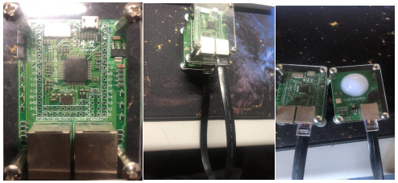
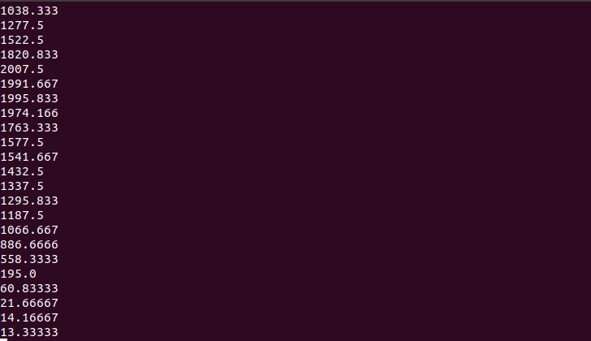

bh1750 光照传感器
---------------------------
模块介绍
^^^^^^^^^^^^^^^^^^^^^
BH1750FVI 是一种用于两线式串行总线接口的数字型光强度传感器集成电路。这种集成电路可以根据收集的光线强度数据来调整液晶或者键盘背景灯的亮度。利用它的高分辨率可以探测较大范围的光强度变化。（1lx-65535lx）两个模块通过连接线相连。

编程学习
^^^^^^^^^^^^^^^^^^^^^
编写程序，读取bh1750光照传感器中的信息,代码如下：
 ::

    #在main.py中编程引用库函数
    import pyb
    
    from pyb import UART
    from pyb import Pin
    from pyb import I2C
    import time
    
    #定义bh1750类，定义各种模式
    class BH1750():
    	PWR_OFF = 0x00
    	PWR_ON = 0x01
    	RESET = 0x07
    
    	# modes
    	CONT_LOWRES = 0x13
    	CONT_HIRES_1 = 0x10
    	CONT_HIRES_2 = 0x11
    	ONCE_HIRES_1 = 0x20
    	ONCE_HIRES_2 = 0x21
    	ONCE_LOWRES = 0x23
      
      #初始化函数：
    	# default addr=0x23 if addr pin floating or pulled to ground
    	# addr=0x5c if addr pin pulled high
    	def __init__(self, bus, addr=0x23):
     		self.bus = bus
    		self.addr = addr
    		self.off()
    		self.reset()
    
    	def off(self):
    		"""Turn sensor off."""
    		self.set_mode(self.PWR_OFF)
    
    	def on(self):
    		"""Turn sensor on."""
    		self.set_mode(self.PWR_ON)
    
    	def reset(self):
    		"""Reset sensor, turn on first if required."""
    		self.on()
    		self.set_mode(self.RESET)
        
    #设模式函数：
    	def set_mode(self, mode):
    		"""Set sensor mode."""
    		self.mode = mode
    		self.bus.send(self.mode,addr=self.addr)
        
    #测量函数：
    	def luminance(self, mode):
    		"""Sample luminance (in lux), using specified sensor mode."""
    		# continuous modes
    		if mode & 0x10 and mode != self.mode:
    			self.set_mode(mode)
    		# one shot modes
    		if mode & 0x20:
    			self.set_mode(mode)
    		# earlier measurements return previous reading
    		if mode in (0x13, 0x23):
    			time.sleep_ms(24)
    		else:
    			time.sleep_ms(180)
    		data = self.bus.recv(16,addr=self.addr)
    		if mode in (0x11, 0x21):
    			factor = 2.0
    		else:
    			factor = 1.0
    		
    		print ((data[0]<<8 | data[1]) / (1.2 * factor))
        
    #初始化I2C 并循环测量：
    while 1:
    	#print ('setp0')
    	i2c=I2C(1,I2C.MASTER)
    	#print ('setp1')
    	S=BH1750(i2c)
    	#print ('setp2')
    	S.luminance(BH1750.ONCE_HIRES_1)
    	#print ('setp3')
    
实验现象
^^^^^^^^^^^^^^^^^^^^^
按RST按键重启pyboard，加载程序。打开终端，就可看到读取的光照强度数值。

根据数据可发现光照越强数值越大

