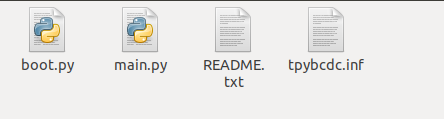

board与电脑的连接
-------------------------

连接说明
^^^^^^^^^^^^^^^^^^^^^

首先，通过USB线将Typeboard与电脑连接，连接成功时板子上的绿灯会在0.5s内亮起，当其熄灭则表示开机启动程序已完成。

连接上后，window系统会将其视作移动磁盘，在本处其名称为PYBFLASH，可以看到仅有92KB的空间。

打开之后，其中包含有四个文件：

boot.py – 这个脚本执行时TPYBoard开发板启动。它设置了开发板的多个选项参数。 

main.py – 这是包含Python程序的主要脚本。在 boot.py 运行后被执行 

README.txt – 包含开启Python的必要基础信息。 

pybcdc.inf – 这是一个Windows驱动文件，配置串行USB装置

恢复出厂设置
^^^^^^^^^^^^^^^^^^^^^
连接USB线

按住USER键，然后按下复位键

松开复位键，保持USER键

这时LED将循环显示：绿－》黄－》绿+黄－》灭

等黄绿灯同时亮时松开USER键，这时黄绿灯会同时快速闪4次

然后红灯亮起（这时红绿黄灯同时亮）

红灯灭，pyboard开始进行恢复到出厂状态

所有灯都灭，恢复出厂设置完成。