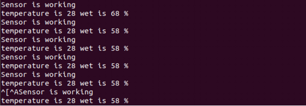

dht11温湿度传感器
------------------
模块介绍
^^^^^^^^^^^^^^^^^^^^^
DHT11是一款有已校准数字信号输出的温湿度传感器。其精度湿度+-5%RH，温度+-2℃，量程湿度20-90%RH，温度0~50℃。下面详细讲解使用pyboard读取dht11温湿度传感器信息的过程。

.. image:: ../picture/ws00.jpg

编程学习
^^^^^^^^^^^^^^^^^^^^^
读取dht11温湿度传感器信息，代码如下：
 ::

    # 在main.py中编写函数读取温湿度数值
    # 引入库函数：
    import pyb
    from pyb import UART
    from pyb import Pin
    import time
    
    #定义DHT11类，初始化引脚：
    class DHT11:
        def __init__(self,pin_):
            #self.data=[]
            self.PinName=pin_
            time.sleep(1)
            self.N1 = Pin(pin_, Pin.OUT_PP)
            #start work
            #N2.low()
            pyb.delay(10)
    #读温度函数，按照时序设置引脚电平高低：
        def read_temps(self):
            data=[]
            j=0
            N1 = Pin(self.PinName, Pin.OUT_PP)
            #N1=self.N1
            N1.low()
            time.sleep_ms(20)
            N1.high()
            time.sleep_us(30)
            #wait to response
            N1 = Pin(self.PinName,Pin.IN)
            while N1.value()==1:
    		#print('1')
    		continue
            while N1.value()==0:
    		#print('2')
    		continue
            while N1.value()==1:
    		#print('3')
    		continue
            #通过引脚接收数据：
            while j<40:
                k=0
                while N1.value()==0:
                    continue
                while N1.value()==1:
    		#print(k)
                    k+=1
                    if k>100:break
                if k<3:
                    data.append(0)
                else:
                    data.append(1)
                j=j+1
            print('Sensor is working')
    	#print(k)
            j=0
            #利用接收的电平信号算出温湿度数值：
            humidity_bit=data[0:7]
            humidity_point_bit=data[8:15]
            temperature_bit=data[16:23]
            temperature_point_bit=data[24:31]
            check_bit=data[32:39]
            humidity=0
            humidity_point=0
            temperature=0
            temperature_point=0
            check=0
            for i in range(7):
                humidity+=humidity_bit[i]*2**(7-i)
                humidity_point+=humidity_point_bit[i]*2**(7-i)
                temperature+=temperature_bit[i]*2**(7-i)
                temperature_point+=temperature_point_bit[i]*2**(7-i)
                check+=check_bit[i]*2**(7-i)
            tmp=humidity+humidity_point+temperature+temperature_point
            if check==tmp:
                print('temperature is',temperature,'wet is',humidity,'%')
            else:
                print('SHUJUCUOWU',humidity,humidity_point,temperature,temperature_point,check)
            return str(temperature)+','+str(humidity)
            
    #将X4引脚传入DHT11类循环测量温湿度数值：
    while 1:
    	S=DHT11('X4')
    	A=S.read_temps()
    	#print(A)
    	pyb.delay(1000)

实验现象
^^^^^^^^^^^^^^^^^^^^^

按RST按键重启pyboard，加载程序。打开终端，就可看到读取的温湿度数值

