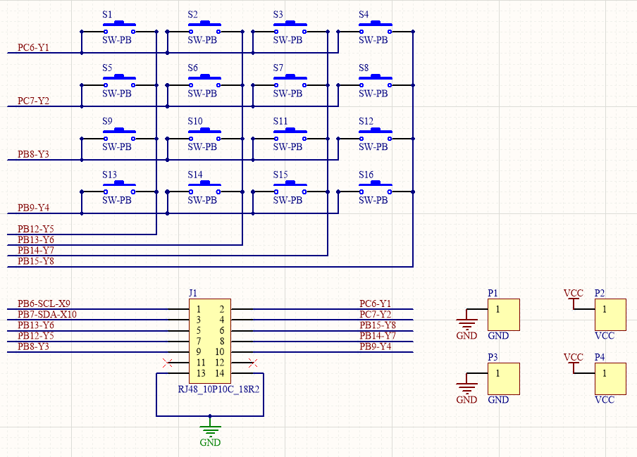

KEY
==================

.. 按键
  1. trailbreaker 用户按键使用，按下按键打印按键被按下信息
  2. 按键阵列焊接，直插式按键，作为焊接教学入门
  3. 按键阵列原理
  4. Python读取按键位置

trailbreaker用户按键操作
-----------------------
todo

按键焊接
-------------
工具
..........
电烙铁、焊锡丝、松香、电路板、按键

步骤
..........
第一步：学习工具：电烙铁，及基本操作
第二步：熟悉电路板及元器件
第三步：器件装配
第四步：器件焊接

焊接步骤
..........
1. 用烙铁头加热焊盘和焊脚
2. 送上焊锡丝，保持到焊锡丝融化
3. 2-3秒后移开焊锡丝，然后移开烙铁头

按键阵列原理
-----------------------
原理图

原理图可以看出按键阵列信号包含行和列，阵列信号配置行信号上拉输出，列信号下拉输入
第一步，将行信号输出全部拉低，第二步依次拉高各行，并检测列输入是否全零，全零则表示无按键按下，否则有按键按下
然后根据行信号和列信号即可判断哪个位置有按键按下。

