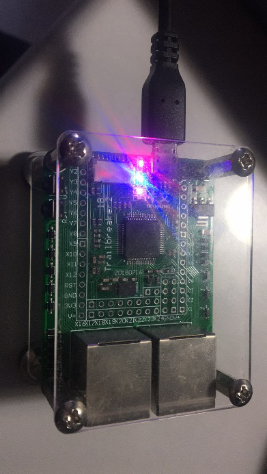

跑马灯
------------------
编程学习
^^^^^^^^^
打开main.py文件开始编写代码:
导入头文件:

 :: 

    import pyb

之后开始实例化LED灯，使用pyb文件中的LED类来对LED灯进行实例化，在定义时，其定义函数依次为LED（1）、LED（2）、LED（3）、LED（4）。
在这里，我们使用元组的形式来对LED灯进行定义，代码为：

 ::

    leds = [pyb.LED(i) for i in range(1,5)]

设置完毕后，即可编写函数实现跑马灯，基本思想为：设置变量n，对变量n进行加一后模4运算，依据所得结果对LED灯组进行翻转操作，每个翻转操作后延时一定时间，达到跑马灯的效果。为了处理异常情况，我们在代码的外层添加了try…finally…语句。代码如下：

 ::

    n = 0
    
    try:
       while True:
          n = (n + 1) % 4
          leds[n].toggle()
          pyb.delay(50)
    finally:
        for l in leds:
            l.off()

实验现象
^^^^^^^^^^^
跑马灯效果如下图

