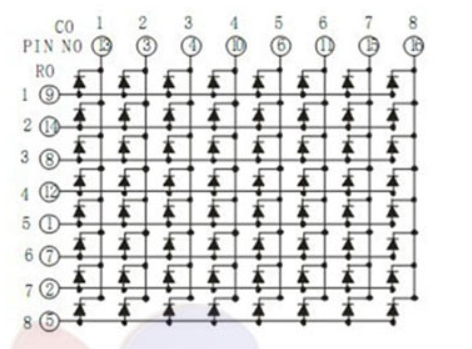
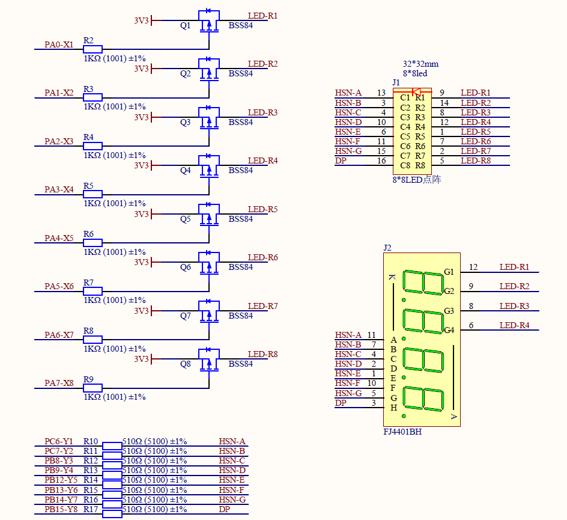

LED MATRIX
==================
author: xubh

:: LED阵列扫描
  扫描原理
  驱动能力
  焊接
  Python实现逐行点亮LED
  Python实现逐列点亮LED
  Python实现图案显示
  Python实现汉字显示

扫描原理
------------------
LED点阵内部原理

LED扫描原理类似于按键阵列，不同的是LED阵列均的控制信号均为输出
LED点阵选择的是共阳极类型，所以点亮方法为，阳极拉高，阴极拉低。
参考原理图，需要给Q1-Q8 P-MOS管的g极加低电压使gs产生压差MOS管导通，从而给点阵阳极供电。
考虑驱动能力问题，X1-X8同时只能1个为低电平。

驱动能力
------------------
单片机的IO驱动能力体现在最大输入、输出电流上，一般为20mA。这个电流驱动1-2个LED是没问题的，但是驱动更多的LED就可能因驱动能力不足而导致无法点亮或亮度不够
为增加IO口的驱动能力，一般是增加三极管或MOS管，电路中使用的是P-MOS管进驱动的。当MOS管的g极与s极之间存在负压时MOS管的d-s之间将形成电流通道，等效电阻减小到几十毫欧，
等效二极管阳极接VCC。此处P-MOS管可等价于由IO控制开关，IO为高开路，IO为低导通。
考虑驱动能力同时只能点亮某一行。

焊接
------------------------------------
贴片器件焊接方法

基本方法是，先固定后加固，即先把器件准确固定到PCB上，然后在焊接各管脚并确保无虚焊、无短路。
虚焊：该连在一起的没有连在一起或连接不可靠。
短路：不该连在一起的连在了一起。
检查方法一般采用目测法或短路测量法(万用表蜂鸣器档)。

贴片电阻/电容焊接方法

贴片阻容件的焊接，一般先在一个焊盘上加焊锡，然后用镊子把器件放好，电烙铁融化焊盘上的焊锡完成一端焊接。第二步焊接另一端的焊盘即可。

贴片三极管焊接

与阻容件类似，先在一个焊盘上加锡，然后放置三极管并加热焊锡，使三极管准确固定。之后焊接另外2个焊点，最后在补焊第一个焊点。

集成电路焊接

与三极管类似，不同的是可先准确放置芯片，并用手固定良好，然后电烙铁上挂适量焊锡，并焊接在芯片某处的焊点上使芯片与PCB板固定。然后使用拖焊法焊接集成电电路其他焊点。
拖焊法：先把器件引脚和焊盘之间都焊上较多焊锡，可不管是否存在短路，利用焊锡的流动性，将板子倾斜一定角度，将烙铁头放在起始有焊锡的地方，稍作停留，使焊锡溶化，然后慢慢的拖动烙铁，使焊锡珠在引脚上移动，确保锡珠滚过的引脚之间没有短路，可以在拖焊的过程中左右移动烙铁头。
注意此方法要确保焊锡中的助焊剂未完全挥发，或及时加入松香。

Python实现逐行点亮LED
------------------------------------
根据驱动能力分析，只需要Y1-Y8为低，然后X1-X8依次为低即可，X1-8为低需保持1s然后再切换，
注意X1-X8只能有1个为低，输出应配置为上拉输出

Python实现逐列点亮LED
------------------------------------
逐行实现比较简单，要想逐列实现则需要用到视觉残留的概念。
人眼在观察景物时，光信号传入大脑神经，需经过一段短暂的时间，光的作用结束后，视觉形象并不立即消失，这种残留的视觉称“后像”，视觉的这一现象则被称为“视觉暂留”。
物体在快速运动时, 当人眼所看到的影像消失后，人眼仍能继续保留其影像0.1-0.4秒左右的图像，这种现象被称为视觉暂留现象。

我们可进行简单验证：X1输出低电平，然后Y1输出400ms周期的50%占空比的方波，也就是说LED被点亮200ms，然后被熄灭200ms，如此循环，
当人眼去观察的时候会觉得这个LED一直在亮着。然后缩短LED点亮时间到20ms，熄灭时间保持在200ms。

利用视觉残留，我们把熄灭的200ms是熄灭时间，把这段时间分成10个时间段，每段20ms，在各段时间内依次使(X2,Y1)、(X3,Y1)..(X8,Y1)输出低电平，即分别点亮每一行的第一个LED。
此时我们看到的就是第一列保持被点亮的状态。然后每1s中改变Y1-Y8，即可实现逐列点亮LED。

Python实现图案显示
------------------------------------
逐列点亮试验中，每个20ms时间内改变不是只有Y1-Y8为底，而是X1为低时Y1为低，X2为低时Y2为底...X8为低时Y8为低，则我们看到的将是1条斜线。
因此选中每一行的时候，分别改变Y1-Y8的状态即可实现不同图片的显示。

Python实现汉字显示
------------------------------------
如果把汉字用点阵编码，然后逐行在Y1-Y8上输出，在实现图案显示的基础上即可显示汉字。

