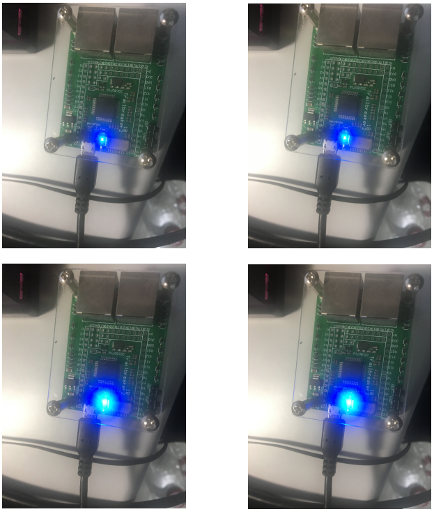

呼吸灯
------------------

编程学习
^^^^^^^^^^^^^^^^^^^^^
打开main.py文件开始编写代码：导入头文件：import pyb

开始实例化LED灯，使用pyb文件中的LED类来对LED灯进行实例化，在定义时，其定义函数依次为LED（1）、LED（2）、LED（3）、LED（4），其中仅有LED（4）可以进行亮度调节。
调节亮度的函数为：LED.intensity(intensity),其中变量intensity的取值范围为0-255，对于其他三个LED灯而言，0代表灭，其他不为0的值则代表点亮LED灯。

如果要实现呼吸灯，则需要一个while循环来对intensity不断的赋值，完成一次循环后延时10ms。其代码如下：
 ::

    # main.py -- put your code here!
    import pyb
    
    led = pyb.LED(4)
    intensity = 0
    while True:
        intensity = (intensity + 1) % 255
        led.intensity(intensity)
        pyb.delay(10) 

实验现象
^^^^^^^^^^^^^^^^^^^^^
呼吸灯结尾表现为一个蓝色的灯不断由暗变亮，反复这个循环。

