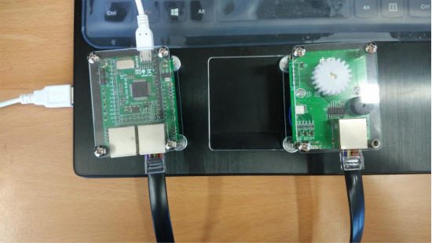

步进电机
------------------
模块介绍
^^^^^^^^^^^^^^^^^^^^^
*  步进电机工作原理

步进电动机用电脉冲信号进行控制，当步进电动机驱动器接收到一个脉冲信号，它就驱动步进电机按设定的方向转动一个固定的角度，当连续不断的给电机发送控制脉冲时，电机就会不停的转动。
每一个脉冲信号对应步进电机的某一相或两相绕组的通电状态改变一次，对应转子就转过一定的角度（步距角），当通电状态的改变完成一个循环时，转子就转过一个齿距。

*  28BYJ-48步进电机

步进电机模块搭载是28BYJ-48步进电机，它是一个四相八拍电机，电压采用DC5V~12V，其实物图和内部结构示意图如下图所示：

28BYJ-48里圈有6个齿，分别标注为0～5，这个叫做转子，转子上的每个齿都是一块永磁体；外圈是定子，跟电机外壳固定在一起，保持不动，上面有8个齿，每个齿上都缠上了一个线圈绕组，正对着的2个齿上的绕组串联在一起，这就形成了四相。
因此，28BYJ-48可以在不同的通电方式下运行，常见的通电方式有：

            四拍（单相绕组通电）：A-B-C-D-A…

            双四拍（双相绕组通电）：AB-BC-CD-DA-AB...

            八拍： A-AB-B-BC-C-CD-D-DA-A…

*  硬件连接

先用RJ48接口线将Trailbreaker开发板和步进电机模块连接起来，然后用USB数据线将Trailbreaker连接到电脑，连接方法如下图所示：

此时电脑出现PYBFLASH盘符，盘中有“boot.py”、“main.py”、“pybcdc.inf”、“README.txt”四个文件：

编程学习
^^^^^^^^^^^^^^^^^^^^^

打开PYBFLASH盘中的“main.py”文件，在该文件中写入以下代码，以控制步进电机齿轮转动180度。

 ::

    # main.py -- put your code here!
    import pyb
    from pyb import Pin
    
    # 获取引脚
    Pin_All=[Pin(p,Pin.OUT_PP) for p in ['X1','X2','X3','X4']]
    
    # 转速(ms) 数值越大转速越慢，最小值为1.8ms
    speed=3
    
    STEPER_ROUND=512  #转动一圈(360度)所需的周期数
    ANGLE_PER_ROUND=STEPER_ROUND/360  #转动1度所需的周期数
    
    # 引脚控制脉冲函数，一个周期
    def SteperWriteData(data):
        count=0
        for i in data:
            Pin_All[count].value(i)
            count+=1
    
    # 电机转动函数，通过双四拍驱动，每拍延迟speed毫秒
    def SteperFrontTurn():
        global speed
        
        SteperWriteData([1,1,0,0])
        pyb.delay(speed)
    
        SteperWriteData([0,1,1,0])
        pyb.delay(speed)
    
        SteperWriteData([0,0,1,1])
        pyb.delay(speed)
        
        SteperWriteData([1,0,0,1])   
        pyb.delay(speed)
    
    # 电机停转函数
    def SteperStop():
        SteperWriteData([0,0,0,0])
    	
    # 控制旋转角度函数，传入参数angle为要旋转的角度
    def SteperRun(angle):
        global ANGLE_PER_ROUND #旋转1度需要的周期数  
        val=ANGLE_PER_ROUND*abs(angle) #总共需要的周期数
        for i in range(0,val):
            SteperFrontTurn()
        angle = 0
        SteperStop()
    
    # 设定要旋转的角度开始驱动步进电机转动
    if __name__=='__main__':
        SteperRun(180) #旋转180度，可以设置任意度数

实验现象
^^^^^^^^^^^^^^^^^^^^^

在给步进电机模块上电后（将其堆叠到Trailbreaker开发板上或和Trailbreaker一起放到底板上），复位Trailbreaker开发板（直接按开发板上的RST键），就可以看到步进电机齿轮刚好转过了180度。

   