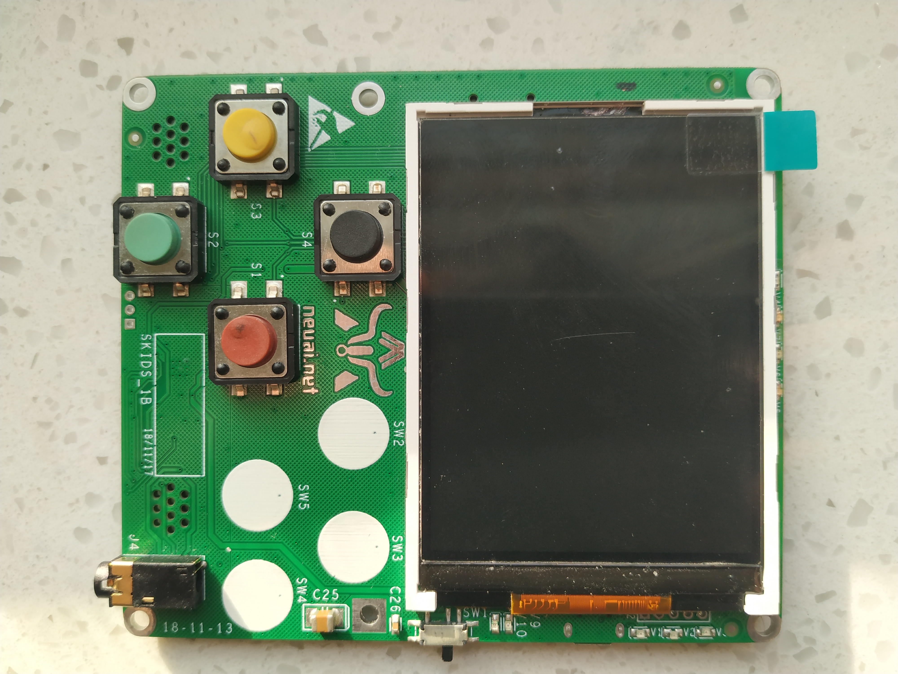

WiFi微信传送
------------------
模块介绍
^^^^^^^^^^^^^^^^^^^^^
ESP32 采用两个哈佛结构 Xtensa LX6 CPU 构成双核系统。所有的片上存储器、片外存储器以及外设都分布在 两个 CPU 的数据总线和／或指令总线上。
除下文列出的个别情况外，两个 CPU 的地址映射呈对称结构，即使用相同的地址访问同一目标。系统中多个外 设能够通过 DMA 访问片上存储器。
两个 CPU 的名称分别是“PRO_CPU”和“APP_CPU”。PRO 代表“protocol（协议）”，APP 代表“application （应用）”。在大多数情况下，两个 CPU 的功能是相同的。

.. image:: ../picture/WiFi02.jpg

编程学习
^^^^^^^^^^^^^^^^^^^^^
main.py代码如下：
 ::

    from machine import UART,Pin
    from umqtt.simple import MQTTClient
    from show.lcd import USR_SPI,ILI9341,color565
    from show.led import check_LED
    
    #MQTT服务端信息
    SERVER = "114.67.229.68"   #MQTT服务器地址
    SERVER_PORT = 3881         #MQTT服务器端口
    DEVICE_ID = b"wc001"        #设备ID
    TOPIC1 = b"/cloud-skids/online/dev/" + DEVICE_ID
    TOPIC2 = b"/cloud-skids/message/server/" + DEVICE_ID
    CLIENT_ID = "f25410646a8348f8a1726a3890ad8f75"
    #username = ""
    #password = ""
    
    #定义UART1
    uart = UART(1, baudrate=115200, bits=8, parity=0, rx=18, tx=19, stop=1)
    
    #设备状态
    ON = "1"
    OFF = "0"
    
    #LCD
    usrspi = USR_SPI(scl=Pin(17, Pin.OUT), sda=Pin(16, Pin.OUT))
    display = ILI9341(usrspi, cs=Pin(0, Pin.OUT))
    
    count = 0
    
    #服务器发给ESP32的信息
    def sub_cb(topic, message):
        message = message.decode()
        print("服务器发来信息：%s" % message)
        global count
        count = count + 1
    
        if count > 27:
            display.text("Clearing, please wait ...", 20, 312, 0xf000, 0xffff)
            display.fill(color565(0xff, 0xff, 0xff))
            count = 1
            display.text("Message from WeChat:", 20, 20, 0xf000, 0xffff)
    
        if count < 10:
            num = "0" + str(count)
        else:
            num = str(count)
        display.text(num, 20, 24 + count * 10, 0x000f, 0xffff)
        display.text(message, 40, 24 + count * 10, 0x0000, 0xffff)
    
        check_LED(message)
        if message == "clear":
            display.text("Clearing, please wait ...", 20, 312, 0xf000, 0xffff)
            display.fill(color565(0xff, 0xff, 0xff))
            count = 0
            display.text("Message from WeChat:", 20, 20, 0xf000, 0xffff)
    
    #启动ESP32
    c = MQTTClient(CLIENT_ID, SERVER, SERVER_PORT)
    c.set_callback(sub_cb)    #设置回调
    c.connect()
    print("连% SERVER)
    c.publish(TOPIC1, ON)     #发布“1”到TOPIC1
    c.subscribe(TOPIC2)       #订阅TOPIC
    display.text("Message from WeChat:", 20, 20, 0xf000, 0xffff)
    
    #接受数据
    try:
        while True:
            #检测并接收服务器发来的信息
            c.check_msg()
    finally:
        c.disconnect()
        print("MQTT连接断开")
    

实验现象
^^^^^^^^^^^^^^^^^^^^^
开发板的液晶屏上，可以显示微信发送过来的消息，当屏幕占满时，可以进行自动清屏操作。